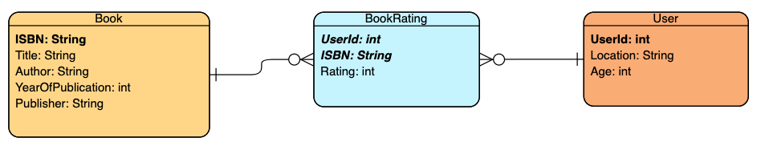
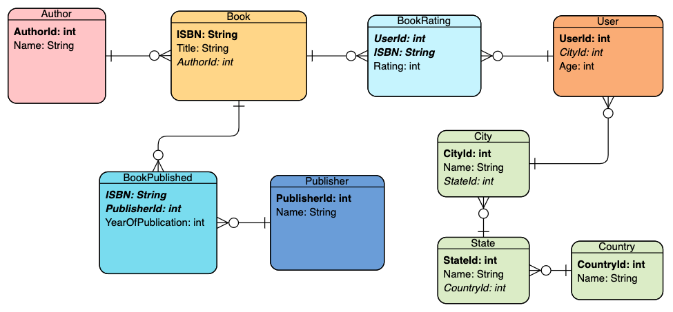
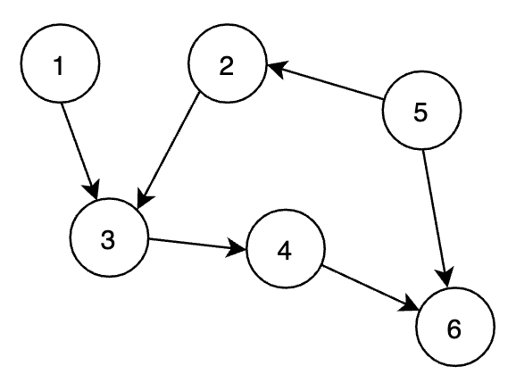
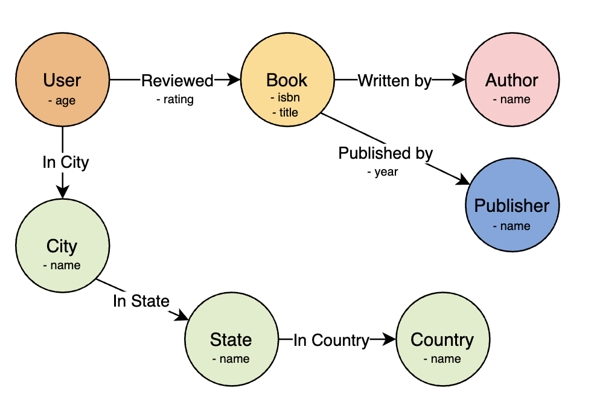
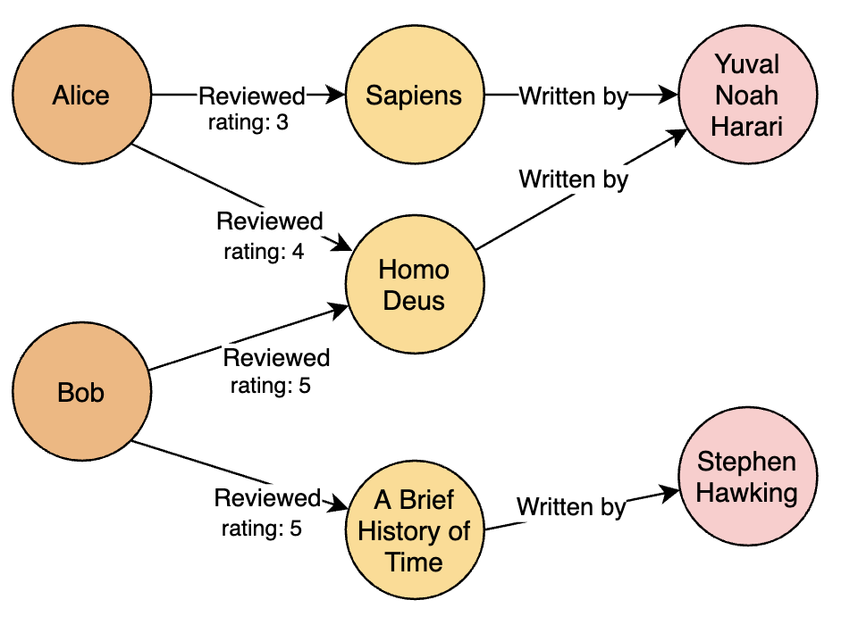
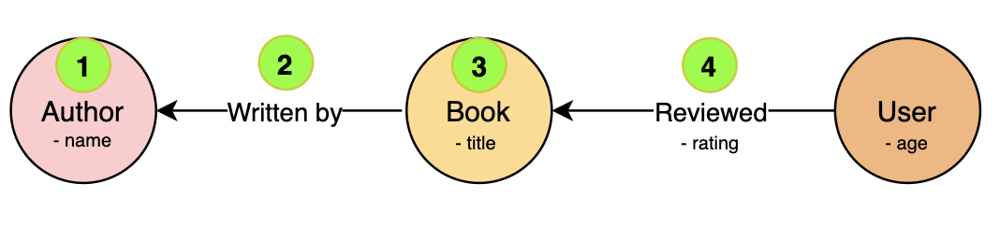
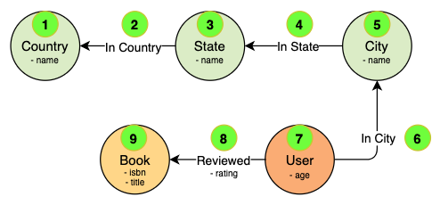

# Modelling data with graphs

Modelling data is a crucial aspect of software engineering. Choosing appropriate data structures or databases is fundamental to the success of an application or a service.

In this article, I will discuss some techniques related to modelling data domains with graphs. In particular, I will show how **labelled property graphs** can be an effective solution to some of the challenges we sometimes encounter with other models such as relational databases, especially with highly-connected data.

By the end of this article we will have a simple -- but fully functional -- implementation of an in-memory labelled-property graph in Java. We'll use this graph to run some queries on a sample dataset.

## Sample domain: book reviews

Before writing this article, I headed over to [kaggle.com](https://kaggle.com) and browsed through some of the data sets available there. Eventually, I picked this [book review data set](https://www.kaggle.com/ruchi798/bookcrossing-dataset) which we'll use as a running example throughout this article.

This data set contains the following CSV files:

- *BX-Users.csv*, with anonymised user data. Each user has a unique id, location and age.
- *BX-Books.csv*, which contains each book's ISBN, title, author, publisher and year of publication. This file also contains links to thumbnail pictures, but we won't use those here.
- *BX-Book-Ratings.csv*, which contains a row for each book review.

If we picture this data set as an [entity-relationship (ER)]([https://en.wikipedia.org/wiki/Entity%E2%80%93relationship_model](https://en.wikipedia.org/wiki/Entity–relationship_model)) diagram, this is how it would look like:



We can see that some fields are [denormalized](https://en.wikipedia.org/wiki/Denormalization), e.g. `Author`, `Publisher`, and `Location`. While this might or might not be what we eventually want (depending on the performance characteristics of certain queries), at this point let's assume we want our data in [normalized form](https://en.wikipedia.org/wiki/Database_normalization). After normalization, this is our updated ER diagram:



Note that we split `Location` into 3 tables (`City`, `State`, and `Country`) because the original fields contained strings such as `"San Francisco, California, USA"`.

Now, suppose we store this data into a relational database. As a thought exercise, how easily can we express these two queries with SQL code?

- **Query 1**: get the average review rating for each author.
- **Query 2**: get all books reviewed by users from a specific country.

If you're familiar with SQL, you're probably thinking *joins*: whenever we have relations that span multiple tables, we typically navigate the relations by joining pairs of tables via primary and foreign keys.

However, both queries involve a non-trivial amount of joins -- especially the second one. This is not necessarily a bad thing -- relational databases can be quite good at executing joins efficiently -- but it might lead to SQL code that is difficult to read, maintain, and optimize.

Moreover, in order to navigate many-to-many relationships, we had to create *join tables* (e.g. `BookRating` or `BookPublished`). This is a common pattern which, however, adds some complexity to the overall schema.

We could denormalize some of the data, but this would have the side-effect of locking us into a specific view of our data and causing our model to be less flexible.

## Book reviews in Java

Now let's suppose we want to store our entire data set in memory. The sample data set that we got from Kaggle contains less than a million entries, so it will easily fit in memory.

Storing our data in memory is a trivial but perfectly valid approach, especially if we want to support a read-only workload and we don't need to guarantee write consistency. If we need to guarantee write consistency, we can still store the data in memory, but we'll probably need to ensure that our data structures are thread-safe and that we persist the changes to non-volatile memory.

We'll start with some classes, for example:

```java
public class Book {
	String isbn;
	String title;
}

public class Author {
	String name;
}
```

Soon, though, we are confronted with a question: how do we link these classes together? How do we establish relationships between books and authors?

In the case of `Book` and `Author`, we might consider that a book has one author (let's keep things simple and suppose each book has only one author), and use a direct reference:

```java
public class Book {
	String isbn;
	String title;
	Author author; // direct reference from book to author
}
```

This makes it trivial to get the author of a book. However, the reverse (getting all books written by an author) is more expensive, because we need to scan the entire list of books. For example, if we're looking for all books by Dan Brown, we need to write something like this:

```java
List<Book> danBrownBooks = books.stream()
                      .filter(b -> b.author.name.equals("Dan Brown"))
											.collect(Collectors.toList());
```

When we have many (e.g. millions) books, this will perform poorly. We could store references to books in the `Author` class itself:

```java
public class Author {
  String name;
  List<Book> books; // direct references from author to books
}
```

However, this solution doesn't "feel" good. Every time we want to change a book's author, we have two places to change.

Besides, how should we handle relationships that contain extra data? For example, the relationship between a book and its publisher contains a piece of extra data, i.e. the year of publication. It's not clear where we should put this field: should we declare it in the `Book` class? Then how do we handle cases when a book has multiple publishers and/or years of publication?

## Labelled property graphs

I would argue that both the relational and the Java reference models share a common trait: **they represent relationships as entity data**.

In both cases, not only does an entity contain attributes about itself (e.g. a `Book` table contains its title and ISBN code) but it also contains data about how it's connected to other entities.

This *entity-centric* (or *table-centric*) model has been widely successful thanks to its efficiency in storing and retrieving huge amounts of entities. If our data has a lot of loosely-connected entities, this is a great model to adopt. However, when our data has a lot of relationships, the fact that these relationships are represented as entity data might result in more complex queries and, overall, in a less flexible model.

Graph models adopt a different approach: **in a graph, relationships are modelled explicitly and are treated as first-class citizens of the data model**, just like entities.

You may recall from mathematics that a graph is a collection of *nodes* (also known as *vertices*) and *edges* (sometimes called *relationships*). Each node stores some data, and each edge connects two nodes. Here's a picture of a sample graph with 6 nodes and 6 edges:



On top of this, a labelled property graph model adds a few extra features:

- Each node and each edge have a *label* which identifies their role in the data model.
- Each node and each edge store a set of key-value *properties*.
- Each edge has a direction, i.e. it is a *directed* graph (as opposed to *undirected* graphs, where edges don't have a direction.)

This is essentially the model that is used by production graph databases such as [Neo4j](https://neo4j.com/developer/guide-data-modeling/) and [Titan](http://s3.thinkaurelius.com/docs/titan/1.0.0/schema.html).

So how can we model the book review domain as a labelled property graph? Here's my first take at it:



Nodes have labels (e.g. the `Book` node is labelled "Book") and some properties -- for example, the `Book` node has two properties, `isbn` and `title`. Node properties are just the same as the attributes we previously identified in our ER diagram.

Edges have labels too (e.g. the edge connecting `User` and `Book` is labelled "Reviewed"). Note how some edges also have properties -- for example, the `Reviewed` edge has the `rating` property, which stores the rating a user gave to a book, and the `Published by` edge has a `year` property, i.e. the year the book was published. Other edges don't have properties -- for example, the `In City` edge that connects a user to the city where they live: we don't need to store any extra data on that relationship.

The picture above represents the *schema* of our graph model. When we create a graph instance and store some data in it, here is how it could be pictured (note that this is just a subset of the entire graph):



This could have easily been drawn on a whiteboard. In fact, when it comes to connected data, adopting a graph model is arguably quite natural and intuitive.

## Implementing a labelled property graph in Java

Let's see how we can implement a labelled property graph in Java. All the code in this section can be found in [this repository](https://github.com/albertoventurini/graph-book-reviews) on Github (the repository also contains code to parse the CSV files from Kaggle.)

We'll start by defining the `Node` and `Edge` classes. We'll also define a common superclass, `GraphElement`, which represents elements that have a label and properties.

```java
public class GraphElement {
    public final String label;
    public final Map<String, Object> properties = new HashMap<>();

    public GraphElement(String label) {
        this.label = label;
    }
}

public class Node extends GraphElement {
    public final String id;
    public final List<Edge> outgoingEdges = new ArrayList<>();
    public final List<Edge> incomingEdges = new ArrayList<>();

    public Node(String label, String id) {
        super(label);
        this.id = id;
    }
    
    public Stream<Edge> incomingEdges(String edgeLabel) {
        return incomingEdges.stream().filter(e -> e.label.equals(edgeLabel));
    }
    
    public Stream<Edge> outgoingEdges(String edgeLabel) {
        return outgoingEdges.stream().filter(e -> e.label.equals(edgeLabel));
    }
}

public class Edge extends GraphElement {
    public final Node source;
    public final Node target;

    public Edge(String label, Node source, Node target) {
        super(label);
        this.source = source;
        this.target = target;
    }
}
```

Nothing surprising here, except maybe those `outgoingEdges` and `incomingEdges` fields in the `Node` class. This is essentially how we connect nodes and edges together, and how we'll navigate the graph to extract meaningful data (we'll see that soon.)

I chose to represent `outgoingEdges` and `incomingEdges` as lists, but these might as well be sets (e.g. hash sets or tree sets) or other structures. The choice depends on a number of factors (e.g. do we need to guarantee uniqueness of each edge? Do we need to efficiently find edges based on some of their properties?) However, these consideration are beyond the scope of this article -- if you are looking for efficient in-memory graph databases, you might want to consider products such as [Memgraph](https://memgraph.com/) or [Neo4j embedded](https://neo4j.com/docs/java-reference/current/java-embedded/). For this example I decided to keep things simple and use plain array lists.

Also, note that each node has an `id` field. Unsurprisingly, the primary function of this field is to guarantee uniqueness of each node.

Next, we'll define the `Graph` class which exposes methods for creating nodes and edges:

```java
public class Graph {
    public final Map<String, Node> nodeIdToNode = new HashMap<>();
    public final Map<String, Set<Node>> nodeLabelToNodes = new HashMap<>();

    public Node createNode(String label, String id) {
        if (nodeIdToNode.containsKey(id)) { throw new DuplicateNodeException(id); }

        final Node n = new Node(label, id);
        
        nodeIdToNode.put(id, n);
        nodeLabelToNodes.get(label).add(n);
        
        return n;
    }

    public Edge createEdge(String label, String fromNodeId, String toNodeId) {
        final Node fromNode = getNode(fromNodeId);
        final Node toNode = getNode(toNodeId);
        
        final Edge e = new Edge(label, fromNode, toNode);
        
        fromNode.outgoingEdges.add(e);
        toNode.incomingEdges.add(e);

        return e;
    }
}
```

The two maps, `nodeIdToNode` and `nodeLabelToNode`, allow us retrieve nodes by their id and label, respectively. This will become especially useful when we start writing queries.

We define a `BookReviewGraph` class as a subclass of `Graph`:

```java
public class BookReviewsGraph extends Graph {

    // Node labels
    public static final String NODE_BOOK = "book";
    public static final String NODE_AUTHOR = "author";
    public static final String NODE_PUBLISHER = "publisher";
    //...
    
    // Edge labels
    public static final String EDGE_WRITTEN_BY = "writtenBy";
    public static final String EDGE_PUBLISHED_BY = "publishedBy";
    // ...

    private void addBook(String isbn, String title) {
        Node node = createNode(NODE_BOOK, isbn); // Use ISBNs as book node ids
        node.properties.put("isbn", isbn);
        node.properties.put("title", title);
    }

    private void addWrittenBy(String isbn, String authorName) {
        String id = "author-" + authorName;
        Node node = createNodeIfAbsent(NODE_AUTHOR, id);
        node.properties.put("name", authorName);
        createEdge(EDGE_WRITTEN_BY, isbn, id);
    }
    
    private void addPublishedBy(String isbn, String publisher, int yearOfPublication) {
        String id = "publisher-" + publisher;
        createNodeIfAbsent(NODE_PUBLISHER, id);
        Edge edge = createEdge(EDGE_PUBLISHED_BY, isbn, id);
        edge.properties.put("year", yearOfPublication);
    }
    
    // ...
}

```

We don't use random-generated ids (e.g. UUIDs); instead, we repurpose entity data as ids. This has a couple of advantages:

- it's easier to debug, and
- it's easier to query (if we're looking for books by author, we can just get the node with id = `"author-" + authorName`)

## Sample queries

Now that we have a basic graph implementation for our book review domain, let's see how we can implement the two queries we introduced before:

- **Query 1**: get the average rating for each author.
- **Query 2**: get all books reviewed by users from a specific country.

### Query 1: average rating for each author

Let's start by writing a query that returns the average rating for a specific author:

```java
public static double getAverageRatingByAuthor(BookReviewsGraph graph, String authorName) {
    return graph
            // (1) Start with the author node
            .getNodeById("author-" + authorName)
            
            // (2) From the author node, take incoming edges with label "EDGE_WRITTEN_BY"
            .incomingEdges(BookReviewsGraph.EDGE_WRITTEN_BY)
            
            // (3) Navigate with the edge source nodes (i.e. book nodes)
            .map(e -> e.source)
            
            // (4) From book nodes, take the incoming edges with label "EDGE_REVIEWED"
            .flatMap(n -> n.incomingEdges(BookReviewsGraph.EDGE_REVIEWED))
            
            // Extract the "rating" property from each review relationship
            .mapToInt(e -> (int) e.properties.get("rating"))
            
            // Take the average as double
            .average()
            
            // In case an author doesn't have ratings (and/or we have some bad data),
            // just return 0
						.orElse(0.0);
    }
```

This query traverses a section of the graph in order to extract the data we want (average rating for each author.) We can break this down into 4 steps:

1. Get the node corresponding to the author we're interested in.
2. Navigate through the "Written by" edges that point to the author node.
3. Get the source nodes of the "Written by" edges. These will be book nodes.
4. Navigate through the "Reviewed" edges that point to the book nodes and extract the `rating` property from these edges.

As a picture:



Using this query, we can easily find the average rating for each author:

```java
public static List<Pair<String, Double>> getAuthorsByAverageRating(BookReviewsGraph graph) {
    return graph.nodeLabelToNodes.get(BookReviewsGraph.NODE_AUTHOR).stream()
            .map(a -> (String) a.properties.get("name"))
            .map(authorName -> Pair.of(authorName, getAverageRatingsByAuthor(graph, authorName)))
            .sorted(Comparator.comparingDouble(p -> -p.second))
            .collect(Collectors.toList());
    }
```

Here's the output of the query with the data set we got from Kaggle:

```
Gustavs Miller 10.0
World Wildlife Fund 10.0
Alessandra Redies 10.0
Christopher J.  Cramer 10.0
Ken Carlton 10.0
Jane Dunn 10.0
Michael Easton 10.0
Howard Zehr 10.0
ROGER MACBRIDE ALLEN 10.0
Michael Clark 10.0
...
```

### Query 2: books reviewed by users from a specific country

This query follows the same pattern as the previous one. We start with country nodes and traverse the graph until we get to book nodes, then we collect book titles.

```java
public static Set<String> getBooksReviewedByUsersInCountry(BookReviewsGraph graph, String country) {
        return graph
                // (1) Get the country node that match the given name
                .getNodeById("country-" + country)
                
                // (2) Take incoming egdes with label "EDGE_IN_COUNTRY"
                .incomingEdges(BookReviewsGraph.EDGE_IN_COUNTRY)
                
                // (3) Take edge source nodes (i.e. state nodes)
                .map(e -> e.source)
                
                // (4) Take incoming edges with label "EDGE_IN_STATE"
                .flatMap(s -> s.incomingEdges(BookReviewsGraph.EDGE_IN_STATE))
                
                // (5) Take edge source nodes (i.e. city nodes)
                .map(e -> e.source)
                
                // (6) Take incoming edges with label "EDGE_IN_CITY"
                .flatMap(c -> c.incomingEdges(BookReviewsGraph.EDGE_IN_CITY))
                
                // (7) Take edge source nodes (i.e. user nodes)
                .map(e -> e.source)
                
                // (8) Take outgoing edges with label "EDGE_REVIEWED"
                .flatMap(u -> u.outgoingEdges(BookReviewsGraph.EDGE_REVIEWED))
                
                // (9) Take edge target nodes (i.e. books)
                .map(e -> e.target)
                
                // Extract "title" property from book nodes
                .map(b -> (String) b.properties.get("title"))
                .collect(Collectors.toSet());
    }
```

As a picture:



Here's the output we get with the Kaggle data set, when we query for books reviewed in Italy:

```
La Tregua
What She Saw
Diario di un anarchico foggiano (Le formiche)
Kept Woman OME
Always the Bridesmaid
A Box of Unfortunate Events: The Bad Beginning/The Reptile Room/The Wide Window/The Miserable Mill (A Series of Unfortunate Events)
Aui, Language of Space: Logos of Love, Pentecostal Peace, and Health Thru Harmony, Creation and Truth
Pet Sematary
Maria (Letteratura)
Potemkin Cola (Ossigeno)
...
```

### Improving performance with indexes

In both queries above, the starting point into the graph is a precise node which we get via the `graph.getNodeById()` method. This works when we know the id of the starting node.

However, in many cases we might not have a starting node -- instead, we might need to start with a *set* of nodes.

For example, suppose we want to code the following query:

* **Query 3**: given a book title, get the average age of users who reviewed a book with that title.

Our starting set of nodes is made up of the books with the given title. We could get this by going through each book node and filtering books with a matching title:

```java
public static double getAverageAgeByBookTitle(BookReviewsGraph graph, String bookTitle) {
        return graph
            // Get all nodes labelled as books
            .getNodesByLabel(BookReviewsGraph.NODE_BOOK).stream()
            
            // Go through each book and filter books where the title matches the given title
            .filter(b -> (b.properties.get("title").equals(bookTitle)))
            
            .flatMap(b -> b.incomingEdges(BookReviewsGraph.EDGE_REVIEWED))
            .map(e -> e.source)
            .mapToInt(u -> (int) u.properties.get("age"))
            .average()
            .orElseThrow();
}
```

This is essentially what databases refer to as a [full table scan](https://en.wikipedia.org/wiki/Full_table_scan): in order to find the books we want, we have to go through all of them sequentially. The cost of this operation is linear in the number of books, so this can potentially take a long time.

In almost all cases (except maybe when the sequence is very short) we can improve performance by using a map (essentially a simplified version of an [index](https://en.wikipedia.org/wiki/Database_index) in the database world).

First, we create a map, which we update every time we add a new book:

```java
public class BookReviewsGraph extends Graph {

    public final Map<String, Set<Node>> booksByTitleIndex = new HashMap<>();

    private void addBook(String isbn, String title) {
        Node node = addNode(NODE_BOOK, isbn);
        node.properties.put("isbn", isbn);
        node.properties.put("title", title);
    
        // Update the books-by-title index
        booksByTitleIndex.computeIfAbsent(title, k -> new HashSet<>());
        booksByTitleIndex.get(title).add(node);
    }
}
```

Now we can use this index at the beginning of our query:

```java
public static double getAverageAgeByBookTitle(BookReviewsGraph graph, String bookTitle) {
        return graph
        
                // Find books where the title matches the given title, using the index
                .booksByTitleIndex.getOrDefault(bookTitle, Collections.emptySet())
                
                .stream()
                .flatMap(b -> b.incomingEdges(BookReviewsGraph.EDGE_REVIEWED))
                .map(e -> e.source)
                .mapToInt(u -> (int) u.properties.get("age"))
                .average()
                .orElseThrow();
}
```

When we run this query on the Kaggle data set, here's the output we get with title "Dracula":

```
30.338983050847457
```

A `HashMap` is a good choice when we want to find exact matches on a certain property, because the average cost of finding exact matches is constant (*O(1)*).

When we want to find entities based on the total order of a certain property (e.g. get all users whose age is above 25), we can use a different data structure, e.g. a [`TreeMap`](https://docs.oracle.com/javase/7/docs/api/java/util/TreeMap.html), where the cost of finding ordered elements is logarithmic.

## Conclusion

- error handling
- thread safety
- alternatives
- code on GitHub